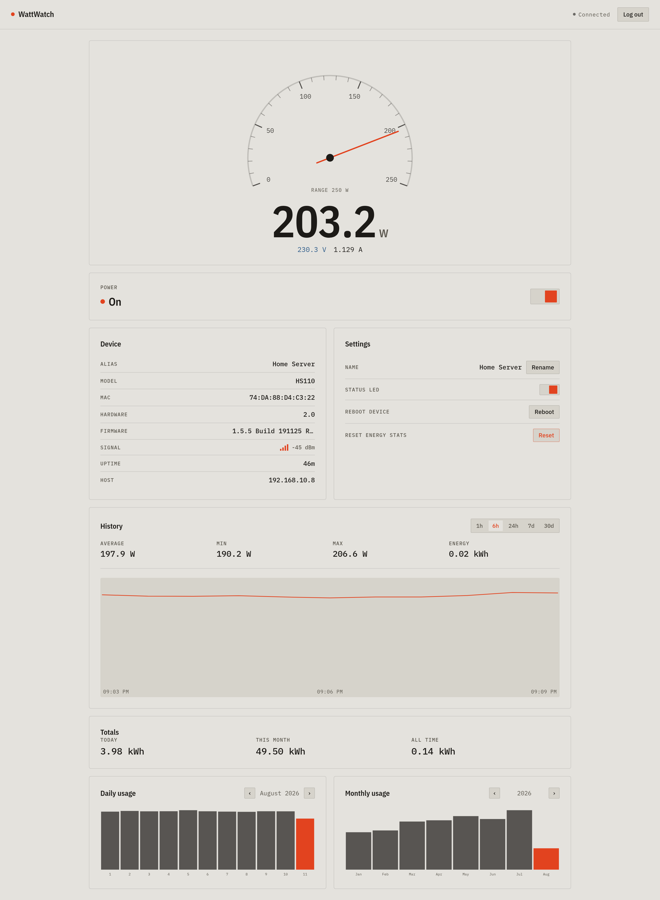

# WattWatch

**Self-hosted control and energy monitoring for a TP-Link Kasa HS110 smart plug.**

<br clear="left">

Talks to the plug directly over your LAN with [python-kasa](https://github.com/python-kasa/python-kasa) — no TP-Link cloud account, no outbound internet dependency. A FastAPI backend polls the plug, stores readings in SQLite, and serves a Svelte dashboard as a single container.



## Features

**Live monitoring** — power (W), voltage (V) and current (A), updating continuously.

**Relay control** — turn the plug on and off, with a confirmation step before cutting power.

**Local history** — a background poller records readings to SQLite every 60 seconds, giving finer-grained graphs than the plug stores natively, plus avg/min/max and integrated kWh over the selected window. History survives redeploys via a Docker volume.

**On-device statistics** — the daily and monthly kWh totals the HS110 accumulates itself, browsable by month and year.

**Device management** — rename the plug, toggle its status LED, reboot it, and reset its accumulated energy counters.

**Device info** — model, MAC, hardware and firmware versions, Wi-Fi signal strength and uptime.

**Single-user auth** — username/password with bcrypt hashing and server-side sessions in an HttpOnly cookie.

## Quick start

```bash
git clone https://github.com/<you>/wattwatch.git
cd wattwatch
cp .env.example .env
$EDITOR .env          # set ADMIN_PASSWORD, and KASA_HOST if it isn't 192.168.10.8
docker compose up -d --build
```

Open <http://localhost:8420> and sign in.

## Configuration

Everything is environment variables; only the first two are required.

| Variable | Default | Description |
| --- | --- | --- |
| `ADMIN_PASSWORD` | *(required)* | Password for the admin account. Hashed with bcrypt into the database on startup. |
| `KASA_HOST` | `192.168.10.8` | LAN IP of the HS110. Give the plug a DHCP reservation or static lease. |
| `ADMIN_USERNAME` | `admin` | Login username. |
| `SECRET_KEY` | *(random per boot)* | Set this to keep sessions valid across restarts. Generate with `python -c "import secrets; print(secrets.token_urlsafe(32))"`. |
| `POLL_INTERVAL_SECONDS` | `5` | How often the plug is polled for live readings. |
| `HISTORY_INTERVAL_SECONDS` | `60` | How often a reading is written to SQLite. |
| `HISTORY_RETENTION_DAYS` | `90` | Age at which stored readings are pruned. `0` disables pruning. |
| `SESSION_LIFETIME_HOURS` | `720` | Session cookie lifetime. |
| `DATABASE_PATH` | `/data/wattwatch.db` | SQLite file location (inside the container). |

Changing `ADMIN_PASSWORD` and restarting updates the stored hash — that is how you rotate the password.

## Deployment (Dokploy)

Created as a **Docker Compose** application pointing at this repository:

1. New application → Docker Compose → connect the GitHub repo, branch `main`.
2. Set `ADMIN_PASSWORD` (and `SECRET_KEY`, `KASA_HOST`) in the environment settings.
3. Deploy. Enable auto-deploy on push if you want it.
4. Point a Traefik route at the container's port **8420**.

TLS and routing are deliberately left to your existing Traefik setup — there is no proxy config in this repo. The app is served at the root of whatever domain you route to it and uses relative asset paths, so a subdomain like `https://watt.example.com/` works with no extra configuration.

The named volume `wattwatch-data` holds the SQLite database. Keep it across deploys or you lose local history (the plug's own daily/monthly counters are stored on the device and are unaffected).

### Networking note

The container reaches the plug over TCP port 9999 via normal outbound bridge networking — no `network_mode: host` required. WattWatch connects to `KASA_HOST` directly rather than using UDP discovery, precisely so that bridge networking is enough. The Docker host does need a route to the plug's subnet.

## Local development

Requires [uv](https://docs.astral.sh/uv/) and Node 20+.

```bash
# Backend on :8420
uv sync
uv run uvicorn wattwatch.main:app --reload --port 8420

# Frontend dev server with hot reload, proxying /api to the backend
cd frontend && npm install && npm run dev
```

The backend starts and serves the API even when the plug is unreachable, so you can work without hardware on the network.

```bash
uv run ruff check .      # lint
uv run ruff format .     # format
uv run pytest            # tests
```

Building the frontend (`cd frontend && npm run build`) writes to `frontend/dist`, which the backend serves directly — that is how the single-container image works.

## Authentication and SSO

Auth is deliberately isolated so it can be replaced without touching route handlers. Every protected router is mounted with a single `require_user` dependency; no handler performs its own auth check.

To move to OIDC (Authelia, Authentik, Keycloak, …), implement the `AuthProvider` protocol in `wattwatch/auth/` and swap the login/callback routes. The session layer, the cookie handling and every route stay as they are. See `wattwatch/auth/__init__.py` for the specifics.

## Notes and limitations

- Built for a **single** HS110. Multiple devices would need a device table and a per-device poller.
- `consumption_total` is read straight from the plug and is not always meaningful on this firmware; the local history totals are the trustworthy figure.
- The HS110 keeps roughly a month of daily totals and a year of monthly totals on-device. Local history is what gives you anything longer or finer.
- Resetting energy statistics clears the plug's own counters permanently. Local SQLite history is untouched.

## Tech

FastAPI · python-kasa · SQLite · Svelte 5 · Vite · uv · ruff · Docker

## License

MIT — see [LICENSE](LICENSE).
